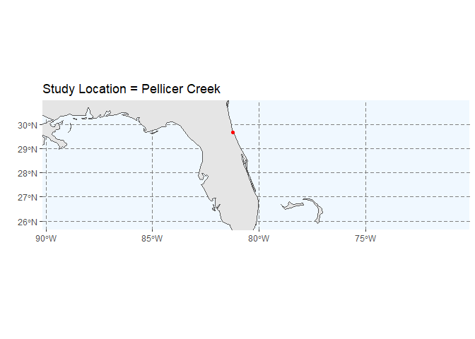
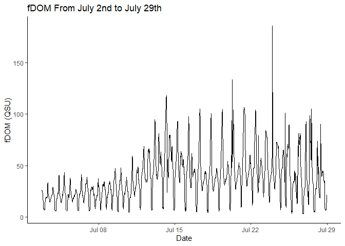
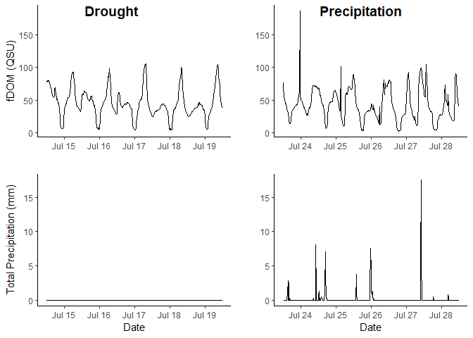
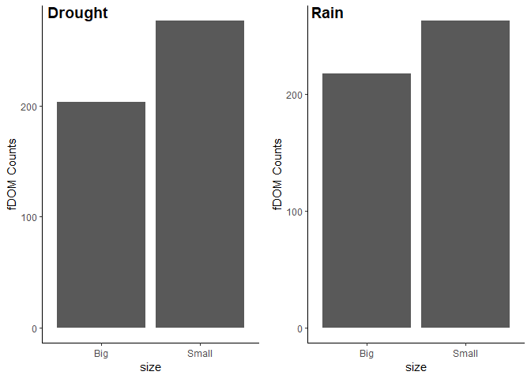
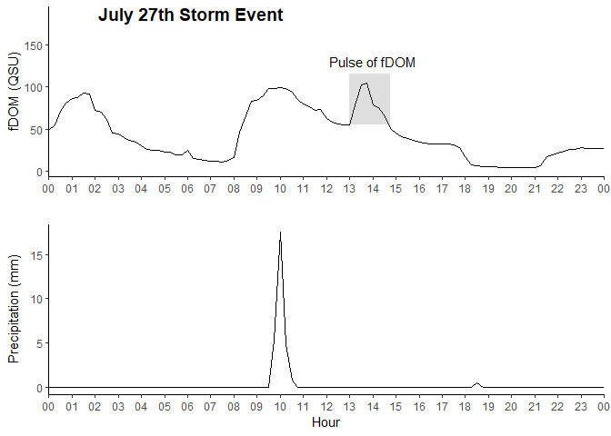
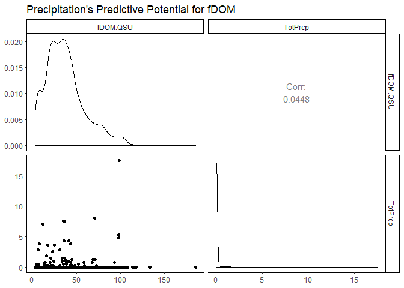

```r
sonde_unite <- unite(Pellicer,
                     "DateTime", Date..MM.DD.YYYY., Time..HH.mm.ss.)

sonde <- mutate(sonde_unite, 
                TimeStamp = ymd_hms(sonde_unite$DateTime))

Precip1 <- mutate(Precip, 
                  TimeStamp = mdy_hm(Precip$DateTimeStamp))

ult_data <- difference_join(sonde, Precip1, 
                            by = "TimeStamp", mode = "inner", max_dist = 180) %>%
  dplyr::select(5:30,44:57) %>%
  rename(Sonde_Time = TimeStamp.x, Precip_Time = TimeStamp.y)
```


```r
#study location: 29.66, -81.22
world <- ne_countries(scale = "medium", returnclass = "sf")
ggplot(data = world) +
    geom_sf() +
    coord_sf(xlim = c(-90.15, -70.12), ylim = c(25.65, 30.97), expand = FALSE) +
  theme(panel.grid.major = element_line(color = gray(.5), linetype = "dashed", size = 0.5), panel.background = element_rect(fill = "aliceblue")) +
  annotate("point", x = -81.22, y = 29.66, colour = "red") +
    ggtitle("Study Location = Pellicer Creek") + 
    xlab("") +
    ylab("")
```

<!-- -->


```r
ggplot(ult_data) + geom_line(aes(x = Sonde_Time, y = fDOM.QSU)) + theme_classic() + xlab("Date") + ylab("fDOM (QSU)") + ggtitle("fDOM From July 2nd to July 29th")
```

<!-- -->


```r
drought_min <- ymd_hm("2019-07-14 12:00")
drought_max <- ymd_hm("2019-07-19 12:00")
```


```r
rain_min <- ymd_hm("2019-07-23 12:00")
rain_max <- ymd_hm("2019-07-28 12:00")
```


```r
ggarrange(fDOM_drought, fDOM_rain, Precip_drought, Precip_rain, ncol = 2, nrow = 2, align = "v", 
          labels = c("           Drought", "        Precipitation"))
```

<!-- -->


```r
ult_data_d$size <- ifelse(ult_data_d$fDOM.QSU < mean(ult_data_d$fDOM.QSU), "Small", "Big") 

ult_data_r$size <- ifelse(ult_data_r$fDOM.QSU < mean(ult_data_r$fDOM.QSU), "Small", "Big")
#no difference between the two for proportions of big to small when comparing to the median
table(ult_data_d$size) #big=241 small=240
```

```
## 
##   Big Small 
##   204   277
```

```r
table(ult_data_r$size) #big=241 small=240
```

```
## 
##   Big Small 
##   218   263
```

```r
drought <- ggplot(ult_data_d) + 
  aes(x=size)+
  geom_bar() +
  ylab("fDOM Counts")+
  theme_classic()

rain <- ggplot(ult_data_r) + 
  aes(x=size)+
  geom_bar() + 
  ylab("fDOM Counts")+
  theme_classic() 

ggarrange(drought, rain, nrow = 1, ncol = 2, labels = c("   Drought", "     Rain"))
```

<!-- -->


```r
ggarrange(pulse, storm, nrow = 2, ncol = 1, align = "v", labels = " July 27th Storm Event")
```

<!-- -->


```r
library(GGally)
```

```
## Registered S3 method overwritten by 'GGally':
##   method from   
##   +.gg   ggplot2
```

```
## 
## Attaching package: 'GGally'
```

```
## The following object is masked from 'package:dplyr':
## 
##     nasa
```

```r
ggpairs(data = ult_data, columns = c(5,38), title="Precipitation's Predictive Potential for fDOM") +
theme_classic()
```

<!-- -->


```r
library(zyp)
```

```
## Loading required package: Kendall
```

```r
#A tool used when heteroscedasticity variability of a variable is unequal across a range of values 
#via the Thiel-sen test

zen_data <- data.frame("fDOM"=ult_data$fDOM.QSU,"Time"=as.numeric(ult_data$Sonde_Time, units="minutes"))

zen <- zyp.sen(fDOM~Time,zen_data)

ci <- confint.zyp(zen)

print(ci)
```

```
##                   0.025         0.975
## Intercept -1.958484e+04 -1.950374e+04
## Time       1.146715e-05  1.360089e-05
```

